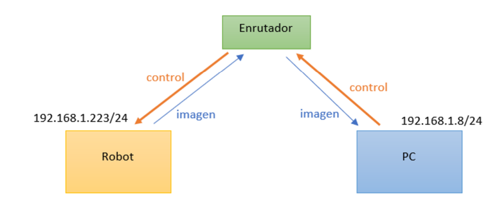

# Evasion de obstaculos con estimacion de profundidad

1. Consta de programas realizados en python y el entrenamiento del modelo en cuaderno de jupyter. 
2. El repositorio cuenta con tres carpetas, la primera contiene los scripts de ejecución en el robot (Control de robot), la segunda carpeta contiene el entrenamiento de clasificación de imágenes (Entrenamiento) y la tercera carpeta contiene los scripts del sistema de evasión (Sistema evasión).
3. Proyecto realizado en Python Tensorflow 2.6 - GPU y ROS. El robot consta de una camara web generica.

Liberias utilizadas:

 
**Estructura del proyecto:** 

 
 **Para Comunicacion ROS (Master-PC : Slave-Raspberry):** Tiene que estar con IP estaticas los respectivos dispositivos.

 **Diagrama de la red:** 

**Comandos:**

Ejecutar el mastro en PC:

- **Roscore**

Carpeta (Sistema Evasion) debe ir PC (Ejecutar en PC):

- **python main_avoid.py**

Obtencion Imagen (Ejecutar en raspberry):

- **rosrun image_view image_view image:=/usb_cam/image_raw**

Carpeta (Control de Robot) debe ir en raspberry (Ejecutar en Raspberry):

- **python main_robot.py**

Modelo Entrenamiento de estimacion de profundidad:

- Yin, Wei y col. (2021). «Learning to recover 3d scene shape from a single image»
https://drive.google.com/file/d/1pbihe_Q5iOmWfmIh0DUXNMLsy0cp8s66/view

Modelo Clasificacion:
- https://drive.google.com/file/d/1hbscxktAibyHYUtHgJeP8WLXskyecOat/view